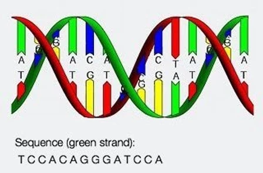

# GeneCpGSequencing

**Objective**:The project requires you to build a neural network to count the number of CpGs (consecutive CGs) in given DNA (of N, A, C, G, T) sequences.Example, given “NCACANNTNCGGAGGCGNA”, the corrected output should be 2

## **Understanding DNA and Gene Sequences**

### **🧬 What is DNA?**
- DNA (**Deoxyribonucleic Acid**) is the **genetic blueprint** of living organisms.
- It is a **double-helix structure** made of **nucleotides**, each consisting of:
  - A **sugar molecule** (deoxyribose)
  - A **phosphate group**
  - A **nitrogenous base** (A, T, C, G)

### **🧬 What are the Four Nucleotide Bases?**
| Symbol | Base Name        | Complementary Base |
|--------|----------------|-------------------|
| **A**  | Adenine (A)    | Thymine (T)       |
| **T**  | Thymine (T)    | Adenine (A)       |
| **C**  | Cytosine (C)   | Guanine (G)       |
| **G**  | Guanine (G)    | Cytosine (C)      |

### **🧬 What is the Role of DNA?**
- DNA **stores genetic information** in the form of **sequences of A, T, C, G**.
- Segments of DNA called **genes** code for **proteins**.
- The **order of nucleotides** determines an organism's traits.

### **🧬 What is "N" in DNA Sequences?**
- "N" represents an **unknown** or **ambiguous** nucleotide.
- It appears in sequences where the base is **not determined**.

### **🧬 What is a Gene?**
- A **gene** is a segment of DNA that contains **instructions to build proteins**.
- Genes are made of **exons (coding regions)** and **introns (non-coding regions)**.

### **🧬 What are CpG Islands?**
- CpG islands are **regions rich in cytosine (C) and guanine (G) pairs (CpG sites)**.
- Found near **gene promoters** and **regulate gene expression**.
- **Methylation of CpG sites** can turn genes **on or off**.

### **🧬 What are Codons?**
- A **codon** is a group of **three nucleotides** (triplet) that codes for an **amino acid**.
- Example:
  - **ATG** → Start codon (Methionine)
  - **TAA, TAG, TGA** → Stop codons (End of a gene)

### **🧬 What are Mutations?**
- A **mutation** is a change in the DNA sequence.
- Types:
  - **Point Mutation** – Single nucleotide change.
  - **Insertion/Deletion** – Extra bases are added or removed.
  - **Substitution** – One base replaces another.

## **🚀 Importance of Nitrogenous Bases & Why Detect CG Pairs?**



### **🧬 Importance of Each Nitrogenous Base**
DNA is composed of **four nitrogenous bases** that play critical roles in genetic coding and cellular functions.

| **Base** | **Name**     | **Function** |
|----------|-------------|-------------|
| **A** | Adenine (A) | Pairs with T; involved in energy transfer (ATP). |
| **T** | Thymine (T) | Pairs with A; stabilizes DNA structure. |
| **C** | Cytosine (C) | Pairs with G; important for gene regulation. |
| **G** | Guanine (G) | Pairs with C; crucial in CpG methylation. |

### **Base Pairing Rules (Chargaff's Rule)**
- **A always pairs with T** (A-T)
- **C always pairs with G** (C-G)
- These **complementary base pairs** form the **DNA double helix**.

---

### **1️⃣ CpG Islands and Gene Regulation**
- **CpG islands** are **regions rich in CG dinucleotides**.
- Found in **promoter regions** of genes, influencing whether a gene is **active (expressed)** or **silent (methylated)**.
- **Methylation of CpG sites** can **turn genes off**, affecting **cell differentiation and cancer progression**.


### **3️⃣ Why Count CpGs?**
- CpG sites **occur less frequently** in the genome due to evolutionary changes.
- However, in **CpG islands**, they are **highly concentrated**.
- **Abnormal CpG counts** can indicate:
  - **Genetic diseases**
  - **Epigenetic modifications**
  - **Mutation hotspots**

---

### **1️⃣ AT Pairs & DNA Structure**
- **A-T base pairs** have **two hydrogen bonds**, making them **less stable** than **C-G pairs** (which have three bonds).
- **A-T-rich regions** are **easier to break**, important for:
  - **DNA replication** (origin of replication is often A-T rich).
  - **Transcription start sites**.

### **2️⃣ Why is AT Not the Focus?**
- A-T pairs **do not undergo methylation** like CpGs.
- A-T regions **do not directly regulate gene activity** the way CpGs do.
- **AT pairs are more common**, making their distribution **less informative** for identifying functional genomic regions.

---

## **🧬 Summary: Why Detect CG (CpG) and Not AT?**
| **Feature**  | **CpG (CG pairs)** | **AT Pairs** |
|-------------|------------------|-------------|
| **Regulation of Gene Expression?** | ✅ Yes (Methylation of CpG affects genes) | ❌ No |
| **Mutation Hotspots?** | ✅ Yes (Prone to mutation in evolution) | ❌ No |
| **Cancer & Epigenetics?** | ✅ Highly relevant | ❌ Not a focus |
| **Genomic Importance?** | ✅ Found in promoter regions | ✅ Found in replication regions |

---
## ** Important Codes **
For local training and model hyperparameter tuning, the following code snippets are used:

```python
python -m src.main
```

For fast-api app deployment, the following code snippets are used:

```python
python -m app
```